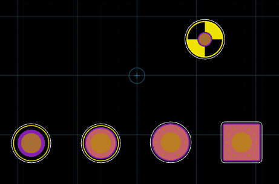
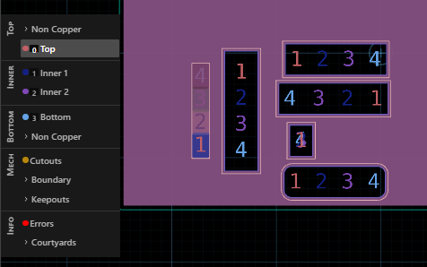
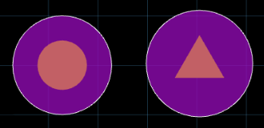
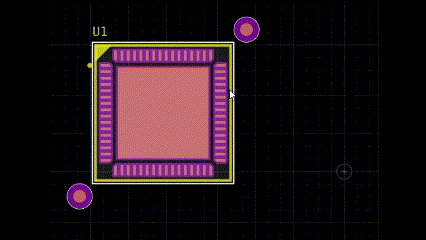

# Mechanical Features

This repository contains a SLM-based library supporting mechanical features in a
PCB. This includes:

1.  Mounting Holes
2.  Fiducials
3.  Layer Legends

# How to use:

Run the following command in your JITX project:

```
$> $SLM add -git JITx-Inc/mechanical
```

This will add a line like this to your `slm.toml` file:

```
[dependencies]
mechanical = { git = "JITx-Inc/mechanical", version = "0.3.0" }
```


# Mounting Holes

Add Mounting Hole components to your design, either explicitly or with automated
tools for placement on a grid.



Features:

1.  Plated or Non-Plated
2.  Customizable Silkscreen
3.  Optional via-in-pad grounding cages

See `examples/MountingHoles.stanza` for more detailed examples.

# Layer Legends

Add Layer Legend Generators to your design:

```
  val num-layers = 4
  inst ll-left : layer-legend(
    LayerLegendPackage(layer-data = num-layers, text-orient = Left)
  )
```



See `examples/LayerLegend.stanza` for more detailed examples

# Fiducials

Add global and local fiducials to your design and customize their appearance. This library provides some reasonable default fiducial landpatterns and symbols as well as the ability to customize fiducial shapes to meet your needs.



In addition, this library provides tools for generating local fiducials around a component and constraining them to that component:

```
  inst U1 : dummy-QFN
  make-local-fiducials(U1)
```



See `examples/LocalFiducials.stanza` for more detailed examples.